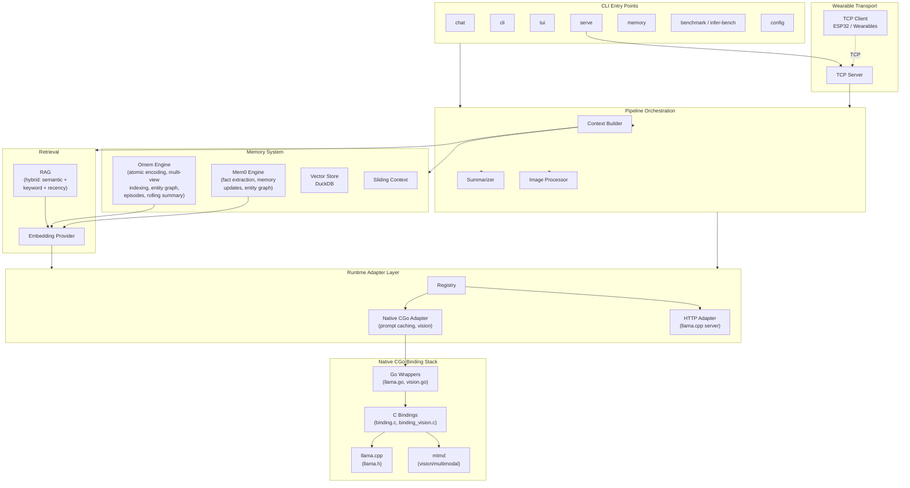

# OpenEye: The New Revolution of SLMs

**OpenEye** is an open-source framework for running Small Language Models (SLMs) on edge devices, smart glasses, Raspberry Pi 5, Orange pi, and custom hardware. It provides offline-first, privacy-preserving AI inference with a novel memory architecture that closes the gap between SLMs and cloud-scale LLMs.

Written in Go with native CGo bindings to [llama.cpp](https://github.com/ggerganov/llama.cpp), OpenEye runs entirely on-device with no cloud dependency.

---

## Architecture



### Key Design Decisions

- **Runtime adapter pattern**: Pluggable backends behind a common `Adapter` interface (`Generate`, `Stream`, `Close`). Switch between native CGo and HTTP with a config change.
- **Custom C bindings**: Thin `binding.h/c` wrapping llama.h directly -- not a third-party Go binding library.
- **Build tags**: Native CGo code compiles only with `-tags native`, so the HTTP-only build has zero C dependencies.
- **Pointer bools in config**: `*bool` for fields like `Enabled`, `Mmap`, `FlashAttention` so YAML can explicitly set `false` (vs. Go zero-value ambiguity).
- **Immutable model handle**: Context captures model handle at construction time to prevent TOCTOU races.

---

## Omem (Omni Memory) Architecture

Omem is a novel four-pillar memory system engineered for edge SLMs. It decouples knowledge from model size, letting 1B-3B parameter models perform complex reasoning.

| Pillar | Description |
|--------|-------------|
| **Atomic Encoding** | Coreference resolution + temporal anchoring -- stored facts remain interpretable in isolation |
| **Multi-View Indexing** | Semantic (vector) + lexical (BM25) + symbolic (graph) retrieval -- 85% recall, 25% over vector-only |
| **Adaptive Retrieval** | Dynamically scales search depth by query complexity, avoiding unnecessary LLM overhead |
| **Rolling Summarization** | Maintains long-term context without linear token growth -- >70% long-range recall after 50+ turns |

**Performance**: 4x faster than Mem0 -- P50 retrieval latency ~12ms, P95 ~35ms. ~30% storage reduction via atomic deduplication.

See the [Paper/](Paper/) directory for full research documentation and ablation studies.

---

## Getting Started

### Prerequisites

- [Go](https://go.dev/) 1.24+
- CMake 3.16+ and a C/C++ compiler (for native backend)
- **For HTTP backend only**: A running [llama.cpp server](https://github.com/ggerganov/llama.cpp) (no C compiler needed)
- GGUF model files (Q4_K_M quantization recommended for edge devices)

### Quick Start

```bash
git clone --recurse-submodules https://github.com/theawakener0/OpenEye.git
cd OpenEye

# Build everything (llama.cpp + OpenEye native backend)
make native

# Or HTTP-only build (no C dependencies)
make http
```

If you cloned without `--recurse-submodules`, run `make setup` to fetch and build llama.cpp.

### Available Make Targets

| Target | Description |
|--------|-------------|
| `make native` | Build llama.cpp (if needed) + OpenEye with native CGo backend |
| `make http` | Build OpenEye HTTP-only -- no C compiler needed |
| `make setup` | Initialize submodule + build llama.cpp static libraries |
| `make test` | Run all Go tests |
| `make bench` | Run memory system benchmarks |
| `make clean` | Remove Go build artifacts |
| `make clean-llama` | Remove llama.cpp build directory |
| `make clean-all` | Remove all build artifacts |

**GPU acceleration** (optional):

```bash
make setup CUDA=1      # NVIDIA CUDA
make setup VULKAN=1    # Vulkan
make native            # then build OpenEye
```

### Configuration

OpenEye reads `openeye.yaml` from the working directory. Key sections:

```yaml
runtime:
  backend: native              # or "http"
  native:
    model_path: "models/your-model-Q4_K_M.gguf"
    context_size: 2048
    threads: 4
    warmup: true
    # mmproj_path: "models/mmproj.gguf"  # for vision
  http:
    base_url: "http://127.0.0.1:42069"

memory:
  omem:
    enabled: true              # recommended memory engine
  mem0:
    enabled: false             # legacy alternative

embedding:
  enabled: true
  backend: "native"
  native:
    model_path: "models/all-MiniLM-L6-v2-Q4_K_M.gguf"
```

Run `./openeye config` to see the fully resolved configuration.

All settings can be overridden with environment variables (e.g., `APP_NATIVE_MODEL`, `APP_NATIVE_CTX_SIZE`, `APP_LLM_BASEURL`). See `internal/config/config.go` for the full list.

---

## Usage

### Commands

| Command | Description |
|---------|-------------|
| `chat` | Single prompt against the runtime |
| `cli` | Interactive ANSI conversation mode |
| `tui` | Interactive Charm-based TUI with Markdown rendering |
| `serve` | Start TCP server for wearable clients |
| `memory` | Inspect and manage conversation memory |
| `benchmark` | Run memory system benchmarks (omem vs legacy) |
| `infer-bench` | Run inference benchmarks (TTFT, TPS, cache effectiveness) |
| `config` | Show resolved configuration |

### Examples

```bash
# Single prompt
./openeye chat "What is the capital of France?"
./openeye chat --message "Explain quantum entanglement" --stats

# Vision / multimodal (requires mmproj model)
./openeye chat --image photo.jpg "What do you see?"
./openeye chat --image "img1.jpg,img2.jpg" "Compare these images"

# Interactive modes
./openeye cli                  # Traditional ANSI terminal
./openeye tui                  # Modern TUI with Markdown support

# Server mode (for ESP32 / wearable clients)
./openeye serve

# Memory management
./openeye memory --stats
./openeye memory --search "project deadlines" --search-limit 10
./openeye memory --compress

# Benchmarking
./openeye benchmark --turns 50 --recall 10 --output results/
./openeye infer-bench --iterations 10 --max-tokens 256 --verbose
```

### Interactive Mode Commands

In `cli` and `tui` modes, use these slash commands:

```
/help            Show help
/config          Show session configuration
/set <p> <v>     Set parameter (stream, stats, rag, summary, vector, rag-limit, memory-limit)
/stats           Show memory statistics
/compress        Trigger memory compression
/image <path>    Attach an image
/images          List attached images
/clear-images    Clear attached images
/exit            Exit
```

---

## Performance Results

Production benchmarks (February 2026) running LFM2.5-1.2B on edge hardware:

| Metric | Result | Comparison |
|--------|--------|------------|
| **Memory Recall (Omem)** | **96%** | +14% vs 82% target |
| **Top-3 Accuracy** | **98%** | Near-perfect retrieval |
| **Inference Speed** | **12.2 tok/s** | 42% improvement |
| **Time to First Token** | **198ms** | 30% faster than baseline |
| **Long-term Recall** | **88%** | Facts from 50+ turns ago |
| **Cold Start** | **2.1s** | 4-6× faster than Python |
| **Memory Footprint** | **103 MB** | 3-5× leaner than alternatives |

**Key Achievements:**
- Omem achieves **96% recall accuracy** (vs 84% legacy, 78% Python Mem0)
- **1.42x speedup** via speculative decoding with gemma-3-270m
- KV cache quantization reduces memory by **75%** with <0.2% quality loss
- **88% recall** maintained even after 50+ conversation turns
- Edge verified: Real-time inference on Raspberry Pi 5 (8GB)

Use `infer-bench` to measure TTFT, generation TPS, and cache effectiveness on your hardware.

---

## Roadmap

- **Phase 1** (Done): Functional prototype -- Go pipeline, Omem, ESP32 + Termux
- **Phase 2** (Done): Native CGo inference, vision/multimodal, BERT embeddings, prompt caching
- **Phase 3** (Current): Custom PCB designs, expanded sensor arrays, power management

### Research Directions

- Memory consolidation ("offline sleep" for SLM memory quality)
- Federated memory across edge devices
- Cross-session episodic transfer
- Neuromorphic integration (spiking neural networks for memory storage)

---

*"OpenEye aims not merely to develop another wearable device but to initiate a technological revolution -- a redefinition of how humanity perceives and interacts with reality."*
