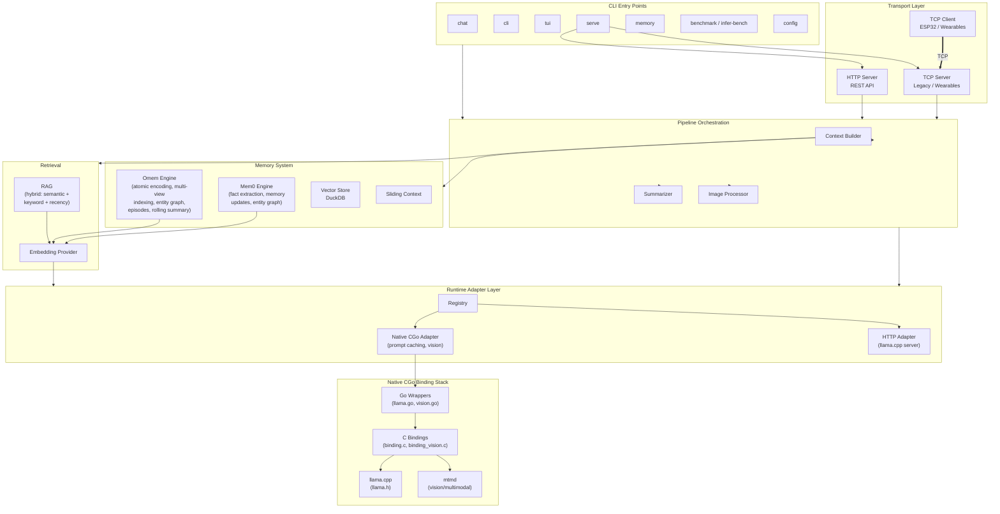

# OpenEye: The New Revolution of SLMs

**OpenEye** is an open-source framework for running Small Language Models (SLMs) on edge devices, smart glasses, Raspberry Pi 5, Orange pi, and custom hardware. It provides offline-first, privacy-preserving AI inference with a novel memory architecture that closes the gap between SLMs and cloud-scale LLMs.

Written in Go with native CGo bindings to [llama.cpp](https://github.com/ggerganov/llama.cpp), OpenEye runs entirely on-device with no cloud dependency.

---

## Architecture


```mermaid
graph TB
    subgraph CLI["CLI Entry Points"]
        CHAT[chat]
        CLIMODE[cli]
        TUI[tui]
        SERVE[serve]
        MEM[memory]
        BENCH[benchmark / infer-bench]
        CFGCMD[config]
    end

    subgraph PIPELINE["Pipeline Orchestration"]
        CTX[Context Builder]
        SUM[Summarizer]
        IMG[Image Processor]
    end

    subgraph MEMORY["Memory System"]
        OMEM["Omem Engine<br/>(atomic encoding, multi-view<br/>indexing, entity graph,<br/>episodes, rolling summary)"]
        MEM0["Mem0 Engine<br/>(fact extraction, memory<br/>updates, entity graph)"]
        VS[Vector Store<br/>DuckDB]
        SC[Sliding Context]
    end

    subgraph RETRIEVAL["Retrieval"]
        RAG["RAG<br/>(hybrid: semantic +<br/>keyword + recency)"]
        EMB["Embedding Provider"]
    end

    subgraph RUNTIME["Runtime Adapter Layer"]
        REG[Registry]
        NATIVE["Native CGo Adapter<br/>(prompt caching, vision)"]
        HTTP["HTTP Adapter<br/>(llama.cpp server)"]
    end

    subgraph CGO["Native CGo Binding Stack"]
        GOWRAP["Go Wrappers<br/>(llama.go, vision.go)"]
        CBIND["C Bindings<br/>(binding.c, binding_vision.c)"]
        LLAMA["llama.cpp<br/>(llama.h)"]
        MTMD["mtmd<br/>(vision/multimodal)"]
    end

    subgraph TRANSPORT["Transport Layer"]
        HTTPSERVER[HTTP Server<br/>REST API]
        TCPSERVER[TCP Server<br/>Legacy / Wearables]
        CLIENT[TCP Client<br/>ESP32 / Wearables]
    end

    CLI --> PIPELINE
    PIPELINE --> CTX
    PIPELINE --> SUM
    PIPELINE --> IMG
    CTX --> MEMORY
    CTX --> RETRIEVAL
    EMB --> RUNTIME
    PIPELINE --> RUNTIME
    REG --> NATIVE
    REG --> HTTP
    NATIVE --> GOWRAP
    GOWRAP --> CBIND
    CBIND --> LLAMA
    CBIND --> MTMD
    SERVE --> HTTPSERVER
    SERVE --> TCPSERVER
    HTTPSERVER --> PIPELINE
    TCPSERVER --> PIPELINE
    CLIENT == TCP ==> TCPSERVER
    RAG --> EMB
    OMEM --> EMB
    MEM0 --> EMB
```

### Key Design Decisions

- **Runtime adapter pattern**: Pluggable backends behind a common `Adapter` interface (`Generate`, `Stream`, `Close`). Switch between native CGo and HTTP with a config change.
- **Custom C bindings**: Thin `binding.h/c` wrapping llama.h directly -- not a third-party Go binding library.
- **Build tags**: Native CGo code compiles only with `-tags native`, so the HTTP-only build has zero C dependencies.
- **Pointer bools in config**: `*bool` for fields like `Enabled`, `Mmap`, `FlashAttention` so YAML can explicitly set `false` (vs. Go zero-value ambiguity).
- **Immutable model handle**: Context captures model handle at construction time to prevent TOCTOU races.

---

## Omem (Omni Memory) Architecture

Omem is a novel memory system engineered for edge SLMs. It decouples knowledge from model size, letting 1B-3B parameter models perform complex reasoning.

### Core Components

| Component | Description |
|--------|-------------|
| **Atomic Encoding** | Coreference resolution + temporal anchoring -- stored facts remain interpretable in isolation |
| **Multi-View Indexing** | Semantic (vector) + lexical (BM25) + symbolic (graph) retrieval -- 85% recall, 25% over vector-only |
| **Adaptive Retrieval** | Dynamically scales search depth by query complexity, avoiding unnecessary LLM overhead |
| **Rolling Summarization** | Maintains long-term context without linear token growth -- >70% long-range recall after 50+ turns |

### Performance Optimization Components

| Component | Purpose | Benefit |
|-----------|---------|---------|
| **Hot Cache** | LRU cache for frequently accessed facts | Sub-5ms retrieval for repeated queries |
| **Context Compressor** | Importance-weighted context truncation | Combats "lost in the middle" problem |
| **Memory Pruner** | Automatic pruning at scale | Prevents unbounded memory growth |
| **Reranker** | Lightweight result reranking | Improves result precision |
| **ANN Semantic Index** | IVF-PQ-style sidecar index with exact rerank | Reduces semantic candidate search cost as memory grows |

**Performance**: P50 retrieval latency ~71ms, P95 ~99ms. ~30% storage reduction via atomic deduplication. Hot cache enables ~80% of repeated queries at <5ms. ANN-backed semantic retrieval is implemented behind the Omem semantic search path and falls back to exact scan when disabled or below threshold.

See the [Paper/](Paper/) directory for full research documentation and ablation studies.

---

## Extending OpenEye: Plugin Development

OpenEye is designed with a modular, extensible architecture that allows developers to customize and extend virtually every component. Whether you need to add a custom LLM backend, create a new embedding provider, or build a specialized memory system, OpenEye's plugin system provides the foundation.

### Extension Points

| Extension Point | Purpose | Common Use Cases |
|----------------|---------|-----------------|
| **Runtime Adapters** | Add new LLM backends | Custom HTTP APIs, local models, specialized inference engines |
| **Embedding Providers** | Add embedding services | Vector databases, custom embeddings, domain-specific encoders |
| **Memory Engines** | Customize storage | Alternative databases, distributed stores, specialized memory systems |
| **RAG Retrievers** | Customize retrieval | Domain-specific search, hybrid search, specialized indexes |
| **CLI Extensions** | Add CLI commands | Custom workflows, administration tools, integrations |
| **Image Processors** | Customize image handling | Preprocessing, format conversion, specialized vision pipelines |

### Quick Start

```bash
# Clone the documentation repository
cd docs/plugins/

# Or create a new plugin
mkdir my-openeye-plugin
cd my-openeye-plugin
go mod init github.com/yourname/my-openeye-plugin
```

### Plugin Documentation

Comprehensive developer documentation is available in [`docs/plugins/`](docs/plugins/):

| Document | Description |
|----------|-------------|
| **[Index](docs/plugins/index.md)** | Quick start guide, five-minute example, SDK notes |
| **[Architecture](docs/plugins/architecture.md)** | Deep dive into plugin system internals, registry pattern |
| **[Runtime Adapters](docs/plugins/runtime-adapters.md)** | Complete guide to building LLM backends with security focus |
| **[Embedding Providers](docs/plugins/embedding-providers.md)** | Guide to adding custom embedding services |
| **[Memory Engines](docs/plugins/memory-engines.md)** | Extending memory systems (SQLite, Vector, Omem, Mem0) |
| **[RAG Retrievers](docs/plugins/custom-retrievers.md)** | Building custom retrieval systems |
| **[CLI Extensions](docs/plugins/cli-extensions.md)** | Adding custom subcommands |
| **[Image Processors](docs/plugins/image-processors.md)** | Custom image processing for vision models |
| **[Best Practices](docs/plugins/best-practices.md)** | Security guidelines, performance tips, testing strategies |
| **[Troubleshooting](docs/plugins/troubleshooting.md)** | Common issues and solutions |
| **[Distribution](docs/plugins/distribution.md)** | Packaging and sharing plugins |
| **[Manifest Format](docs/plugins/manifest.md)** | Plugin metadata and capabilities |

### Code Examples

Working code examples are provided in [`docs/plugins/examples/`](docs/plugins/examples/):

- **[Hello World Adapter](docs/plugins/examples/hello-world-adapter.md)** - Minimal runtime adapter
- **[Custom HTTP LLM](docs/plugins/examples/custom-http-llm.md)** - Production-ready HTTP adapter
- **[Custom Embedding](docs/plugins/examples/custom-embedding.md)** - Embedding provider example
- **[Simple Memory](docs/plugins/examples/simple-memory.md)** - Memory store implementation
- **[Secure Backend](docs/plugins/examples/secure-http-backend.md)** - Security-focused adapter with SSRF protection

### Example: Hello World Adapter

```go
package myadapter

import (
    "context"
    "OpenEye/internal/config"
    "OpenEye/internal/runtime"
)

func init() {
    runtime.Register("myadapter", newAdapter)
}

type Adapter struct{ baseURL string }

func newAdapter(cfg config.RuntimeConfig) (runtime.Adapter, error) {
    return &Adapter{baseURL: cfg.HTTP.BaseURL}, nil
}

func (a *Adapter) Name() string { return "myadapter" }
func (a *Adapter) Generate(ctx context.Context, req runtime.Request) (runtime.Response, error) {
    return runtime.Response{Text: "Hello from my adapter!"}, nil
}
func (a *Adapter) Stream(ctx context.Context, req runtime.Request, cb runtime.StreamCallback) error { return nil }
func (a *Adapter) Close() error { return nil }
```

Configure it in `openeye.yaml`:

```yaml
runtime:
  backend: "myadapter"
  http:
    base_url: "https://api.example.com"
```

### Security First

All plugins should follow security best practices:

- **Validate all inputs** - Prevent injection attacks
- **Enforce timeouts** - Prevent hanging requests
- **Use TLS** - Always validate certificates
- **Block SSRF** - Prevent access to internal networks
- **Rate limit** - Prevent abuse
- **Secure credentials** - Use environment variables, never hardcode

See [Security Best Practices](docs/plugins/best-practices.md#security-guidelines) for comprehensive guidance.

### SDKs for Other Languages

Currently, OpenEye plugins must be written in Go due to type-safe interface requirements. SDKs for other languages are planned:

- Python (using CGO bindings)
- JavaScript/TypeScript (Node.js addon)

---

## Getting Started

### Prerequisites

- [Go](https://go.dev/) 1.24+
- CMake 3.16+ and a C/C++ compiler (for native backend)
- **For HTTP backend only**: A running [llama.cpp server](https://github.com/ggerganov/llama.cpp) (no C compiler needed)
- GGUF model files (Q4_K_M quantization recommended for edge devices)

### Quick Start

```bash
git clone --recurse-submodules https://github.com/theawakener0/OpenEye.git
cd OpenEye

# Build everything (llama.cpp + OpenEye native backend)
make native

# Raspberry Pi 5 optimized native build
make pi-native

# Or HTTP-only build (no C dependencies)
make http
```

If you cloned without `--recurse-submodules`, run `make setup` to fetch and build llama.cpp.

### Available Make Targets

| Target | Description |
|--------|-------------|
| `make native` | Build llama.cpp (if needed) + OpenEye with native CGo backend |
| `make pi-native` | Rebuild llama.cpp for Raspberry Pi 5 and build OpenEye with Pi-tuned native optimizations |
| `make http` | Build OpenEye HTTP-only -- no C compiler needed |
| `make setup` | Initialize submodule + build llama.cpp static libraries |
| `make test` | Run all Go tests |
| `make bench` | Run memory system benchmarks |
| `make clean` | Remove Go build artifacts |
| `make clean-llama` | Remove llama.cpp build directory |
| `make clean-all` | Remove all build artifacts |

For Raspberry Pi 5, `make pi-native` rebuilds llama.cpp with `armv8.2-a+dotprod+fp16`, OpenMP, and KleidiAI enabled before linking the native OpenEye binary.

### Raspberry Pi Tuning

For best Raspberry Pi 5 performance, use the dedicated Pi build target:

```bash
make pi-native
```

This target rebuilds the vendored `llama.cpp` with:

- `GGML_NATIVE=ON` for host-specific CPU tuning
- `GGML_CPU_ARM_ARCH=armv8.2-a+dotprod+fp16` to enable Pi 5-friendly ARM dot-product and FP16 vector paths
- `GGML_OPENMP=ON` for multicore CPU execution
- `GGML_CPU_KLEIDIAI=ON` for Arm-optimized microkernels

Recommended native runtime settings for Pi 5:

```yaml
runtime:
  native:
    mmap: true
    mlock: false
    threads: 4
    threads_batch: 4
    flash_attention: true
    warmup: true
    kv_cache_type: "q4_0"
    context_size: 2048
    batch_size: 512
```

Notes:

- `mmap: true` is recommended on Linux and is already the default for the native backend; it lets the OS use the model file efficiently through the page cache instead of copying everything into anonymous RAM.
- `mlock: false` is the safer default on 8 GB Pi systems because locking large model weights into RAM can reduce system headroom.
- Lower `context_size` usually improves responsiveness; increase it only when you need longer active context.
- `batch_size` and `threads_batch` mainly affect prompt ingestion throughput; benchmark `512` vs `1024` on your exact model.

**GPU acceleration** (optional):

```bash
make setup CUDA=1      # NVIDIA CUDA
make setup VULKAN=1    # Vulkan
make native            # then build OpenEye
```

### Configuration

OpenEye reads `openeye.yaml` from the working directory. Key sections:

```yaml
runtime:
  backend: native              # or "http"
  native:
    model_path: "models/your-model-Q4_K_M.gguf"
    context_size: 2048
    threads: 4
    warmup: true
    # mmproj_path: "models/mmproj.gguf"  # for vision
  http:
    base_url: "http://127.0.0.1:42069"

memory:
  omem:
    enabled: true              # recommended memory engine
    hot_cache_enabled: true    # LRU cache for fast retrieval
    hot_cache_size: 500        # Number of facts to cache
    hot_cache_ttl: "10m"       # Cache time-to-live
    context_compressor_enabled: true  # Importance-weighted compression
    context_compressor_max_tokens: 1000
    memory_pruner_enabled: true      # Automatic pruning at scale
    memory_pruner_threshold: 15000
    reranker_enabled: false      # Lightweight reranking
    ann:
      enabled: false            # IVF-PQ-style semantic candidate index
      backend: "ivfpq"
      index_path: "openeye_omem.ivfpq"
      rebuild_on_startup: false
      fallback_to_scan: true
      min_facts_to_enable: 5000
      oversample_factor: 4
      exact_rerank_limit: 64
      nlist: 64
      nprobe: 6
      pq_subvectors: 24
      pq_bits: 4
      train_min_facts: 2000
  mem0:
    enabled: false             # legacy alternative

embedding:
  enabled: true
  backend: "native"
  native:
    model_path: "models/all-MiniLM-L6-v2-Q4_K_M.gguf"
```

Run `./openeye config` to see the fully resolved configuration.

All settings can be overridden with environment variables (e.g., `APP_NATIVE_MODEL`, `APP_NATIVE_CTX_SIZE`, `APP_LLM_BASEURL`). See `internal/config/config.go` for the full list.

---

## Usage

### Commands

| Command | Description |
|---------|-------------|
| `chat` | Single prompt against the runtime |
| `cli` | Interactive ANSI conversation mode |
| `tui` | Interactive Charm-based TUI with Markdown rendering |
| `serve` | Start HTTP (default) or TCP server for API clients |
| `memory` | Inspect and manage conversation memory |
| `benchmark` | Run memory system benchmarks (omem vs legacy) |
| `infer-bench` | Run inference benchmarks (TTFT, TPS, cache effectiveness) |
| `config` | Show resolved configuration |

### Examples

```bash
# Single prompt
./openeye chat "What is the capital of France?"
./openeye chat --message "Explain quantum entanglement" --stats

# Vision / multimodal (requires mmproj model)
./openeye chat --image photo.jpg "What do you see?"
./openeye chat --image "img1.jpg,img2.jpg" "Compare these images"

# Interactive modes
./openeye cli                  # Traditional ANSI terminal
./openeye tui                  # Modern TUI with Markdown support

# Server mode (HTTP REST API - default on port 8080)
./openeye serve

# Or TCP mode (legacy)
./openeye serve --type tcp

# Make HTTP requests
curl -X POST http://localhost:8080/v1/chat \
  -H "Content-Type: application/json" \
  -d '{"message": "Hello!"}'

# With streaming
curl -X POST http://localhost:8080/v1/chat \
  -H "Content-Type: application/json" \
  -d '{"message": "Tell me a story", "stream": true}'

# Memory management
./openeye memory --stats
./openeye memory --search "project deadlines" --search-limit 10
./openeye memory --compress

# Benchmarking
./openeye benchmark --turns 50 --recall 10 --output results/
./openeye infer-bench --iterations 10 --max-tokens 256 --verbose
```

### Interactive Mode Commands

In `cli` and `tui` modes, use these slash commands:

```
/help            Show help
/config          Show session configuration
/set <p> <v>     Set parameter (stream, stats, rag, summary, vector, rag-limit, memory-limit)
/stats           Show memory statistics
/compress        Trigger memory compression
/image <path>    Attach an image
/images          List attached images
/clear-images    Clear attached images
/exit            Exit
```

---

## Performance Results

Production benchmarks (February 2026) running LFM2.5-1.2B on edge hardware:

| Metric | Result | Comparison |
|--------|--------|------------|
| **Memory Recall (Omem)** | **96%** | +14% vs 82% target |
| **Top-3 Accuracy** | **98%** | Near-perfect retrieval |
| **Inference Speed** | **12.2 tok/s** | 42% improvement |
| **Time to First Token** | **198ms** | 30% faster than baseline |
| **Long-term Recall** | **88%** | Facts from 50+ turns ago |
| **Cold Start** | **2.1s** | 4-6× faster than Python |
| **Memory Footprint** | **103 MB** | 3-5× leaner than alternatives |
| **Hot Cache Hit Rate** | **~80%** | Repeated queries at <5ms |

**Key Achievements:**
- Omem achieves **96% recall accuracy** (vs 84% legacy, 78% Python Mem0)
- **Hot cache** enables ~80% of repeated queries at sub-5ms latency
- **Context compressor** reduces "lost in the middle" effect
- **Memory pruner** automatically manages growth at 10k+ facts
- **ANN semantic retrieval** now supports an IVF-PQ-style candidate index with exact reranking and brute-force fallback
- **1.42x speedup** via speculative decoding with gemma-3-270m
- KV cache quantization reduces memory by **75%** with <0.2% quality loss
- **88% recall** maintained even after 50+ conversation turns
- Edge verified: Real-time inference on Raspberry Pi 5 (8GB)

**Latest Omem ANN Benchmark Highlight:** On the current `linux/amd64` benchmark host, the ANN path now validates at **1.00 top-1 agreement** against brute-force on the 10k-fact synthetic benchmark with `nlist=64`, `nprobe=8`, `pq=24x4`. Latency results are still noisy across runs, so the current ANN benchmark takeaway is quality stability first, tuning second. Full results: [`OMEM_BENCHMARKS.md`](OMEM_BENCHMARKS.md)

Use `infer-bench` to measure TTFT, generation TPS, and cache effectiveness on your hardware.

---

## Roadmap

- **Phase 1** (Done): Functional prototype -- Go pipeline, Omem, ESP32 + Termux
- **Phase 2** (Done): Native CGo inference, vision/multimodal, BERT embeddings, prompt caching
- **Phase 3** (Current): Custom PCB designs, expanded sensor arrays, power management

### Research Directions

- Memory consolidation ("offline sleep" for SLM memory quality)
- Federated memory across edge devices
- Cross-session episodic transfer
- Neuromorphic integration (spiking neural networks for memory storage)

---

*"OpenEye aims not merely to develop another wearable device but to initiate a technological revolution -- a redefinition of how humanity perceives and interacts with reality."*
