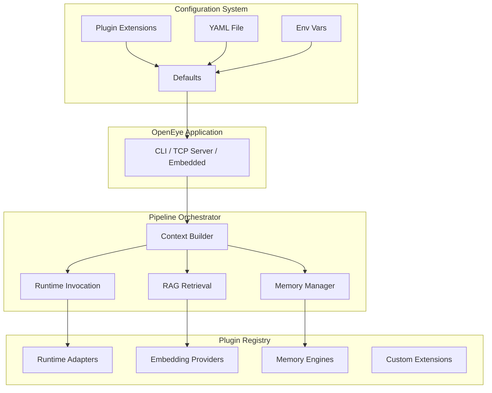
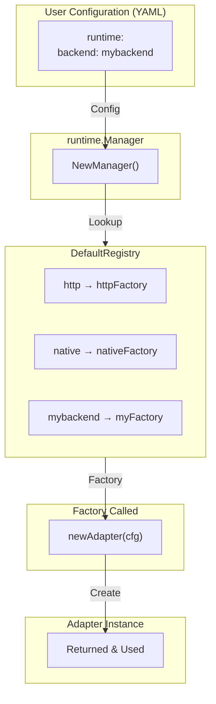
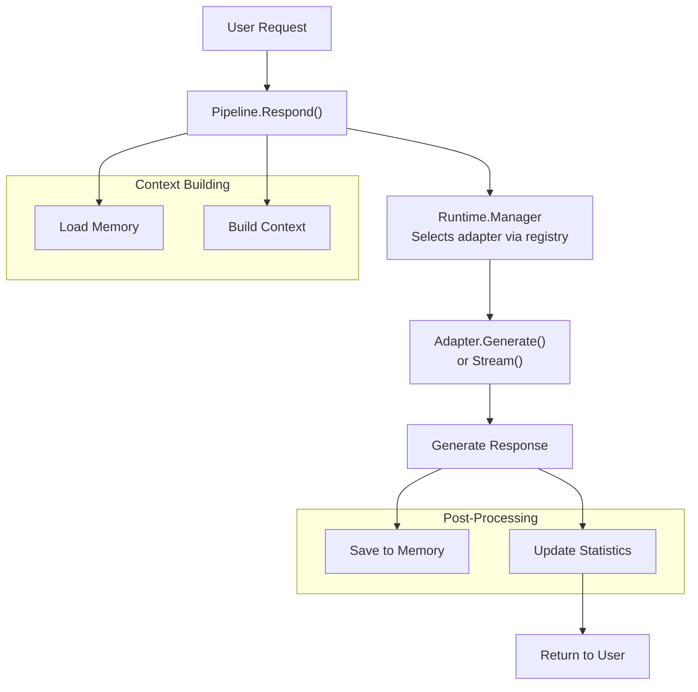

# OpenEye Plugin Architecture

This document provides a deep dive into OpenEye's plugin architecture, explaining the design patterns, registry system, and extension mechanisms that enable plugin development.

## System Architecture Overview



## The Registry Pattern

OpenEye uses a **registry pattern** for plugin integration. Instead of dynamic plugin loading, plugins register themselves at initialization time using Go's `init()` function. This approach provides:

1. **Type Safety**: Plugins implement well-defined interfaces
2. **Compile-Time Verification**: Issues are caught at build time
3. **No Runtime Overhead**: No dynamic library loading complexity
4. **Familiar Go Patterns**: Uses standard Go initialization

### How Registration Works

```go
// internal/runtime/registry.go
package runtime

// Registry maps backend names to factory functions
type Registry map[string]AdapterFactory

// AdapterFactory creates an adapter from configuration
type AdapterFactory func(config.RuntimeConfig) (Adapter, error)

// DefaultRegistry is the global registry instance
var DefaultRegistry = Registry{}

// Register adds a new adapter factory to the default registry
func Register(name string, factory AdapterFactory) {
    DefaultRegistry[name] = factory
}

// Plugin's init() function
func init() {
    // Register the plugin during package initialization
    runtime.Register("mybackend", newAdapter)
}
```

### Registry Resolution Flow



## Plugin Lifecycle

Every OpenEye plugin follows this lifecycle:

### 1. Initialization Phase

```go
// Package initialization - runs before main()
func init() {
    // Register plugin with the appropriate registry
    runtime.Register("myadapter", newAdapter)
}
```

### 2. Configuration Phase

```go
// Called by the registry when the plugin is selected
func newAdapter(cfg config.RuntimeConfig) (runtime.Adapter, error) {
    // Validate required configuration
    if cfg.HTTP.BaseURL == "" {
        return nil, fmt.Errorf("base_url is required for http backend")
    }
    
    // Parse timeout
    timeout := 30 * time.Second
    if cfg.HTTP.Timeout != "" {
        var err error
        timeout, err = time.ParseDuration(cfg.HTTP.Timeout)
        if err != nil {
            return nil, fmt.Errorf("invalid timeout: %w", err)
        }
    }
    
    return &Adapter{
        baseURL: cfg.HTTP.BaseURL,
        timeout: timeout,
    }, nil
}
```

### 3. Runtime Phase

```go
// Plugin is used for inference requests
func (a *Adapter) Generate(ctx context.Context, req runtime.Request) (runtime.Response, error) {
    // Handle requests during application runtime
}
```

### 4. Shutdown Phase

```go
// Clean up resources when the application closes
func (a *Adapter) Close() error {
    // Close connections, files, etc.
    return nil
}
```

## Configuration System Integration

OpenEye plugins integrate with a hierarchical configuration system:

### Configuration Precedence (Highest to Lowest)

1. **Environment Variables** - `APP_*` prefixed variables
2. **YAML Configuration File** - `openeye.yaml`
3. **Plugin Defaults** - Default values in the plugin
4. **OpenEye Built-in Defaults** - Framework defaults

### Environment Variable Mapping

```go
// Example: Applying environment overrides
func applyEnvOverrides(cfg *Config) {
    if v := os.Getenv("APP_LLM_BASEURL"); v != "" {
        cfg.Runtime.HTTP.BaseURL = v
    }
    if v := os.Getenv("APP_LLM_TIMEOUT"); v != "" {
        cfg.Runtime.HTTP.Timeout = v
    }
}
```

### Configuration Structure for Plugins

```go
// Define plugin configuration in a structure that matches YAML
type MyPluginConfig struct {
    APIKey     string `yaml:"api_key"`
    Model      string `yaml:"model"`
    Temperature float64 `yaml:"temperature"`
    MaxTokens  int    `yaml:"max_tokens"`
    Timeout    string `yaml:"timeout"`
}

// In newAdapter function:
func newAdapter(cfg config.RuntimeConfig) (runtime.Adapter, error) {
    // Access HTTP configuration
    baseURL := cfg.HTTP.BaseURL
    
    // Define defaults for your plugin
    defaults := runtime.GenerationOptions{
        MaxTokens:   512,
        Temperature: 0.7,
    }
    
    // Merge with config defaults
    opts := mergeOptions(defaults, cfg.Defaults)
    
    return &Adapter{
        baseURL: baseURL,
        options: opts,
    }, nil
}
```

## Extension Point Interfaces

### Runtime Adapter Interface

The `runtime.Adapter` interface is the most common extension point:

```go
package runtime

// Adapter is the contract runtime backends must implement
type Adapter interface {
    // Name returns a human-readable identifier for the adapter
    Name() string
    
    // Generate performs a single-shot completion request
    Generate(ctx context.Context, req Request) (Response, error)
    
    // Stream performs real-time token streaming
    Stream(ctx context.Context, req Request, cb StreamCallback) error
    
    // Close releases any resources held by the adapter
    Close() error
}
```

### Embedding Provider Interface

```go
package embedding

// Provider exposes semantic embedding capabilities
type Provider interface {
    // Embed converts text to a vector embedding
    Embed(ctx context.Context, text string) ([]float32, error)
    
    // Close releases resources
    Close() error
}
```

### Request and Response Types

```go
// Request contains the prompt and generation options
type Request struct {
    Prompt  string
    Image   []string  // For multimodal models
    Options GenerationOptions
}

// GenerationOptions maps to common inference parameters
type GenerationOptions struct {
    MaxTokens     int
    Temperature   float64
    TopK          int
    TopP          float64
    MinP          float64
    RepeatPenalty float64
    RepeatLastN   int
    Stop          []string
}

// Response contains the generated text and statistics
type Response struct {
    Text   string
    Stats  Stats
    Raw    any
    Finish string
}

// Statistics about the generation
type Stats struct {
    TokensEvaluatedGenerated int
    int
    Tokens TokensCached    int
    Duration        time.Duration
    TTFT            time.Duration  // Time to first token
    PromptTPS       float64         // Prompt processing throughput
    GenerationTPS   float64         // Generation throughput
}
```

## Pipeline Integration

The OpenEye pipeline orchestrates plugin usage:

```go
// internal/pipeline/pipeline.go
type Pipeline struct {
    cfg      config.Config
    manager  *runtime.Manager    // Uses runtime adapters
    store    *memory.Store       // Uses memory engines
    embedder embedding.Provider  // Uses embedding providers
    // ... other components
}
```

### Pipeline Request Flow



## Error Handling Contracts

All plugins must follow these error handling rules:

### Error Return Pattern

```go
func (a *Adapter) Generate(ctx context.Context, req runtime.Request) (runtime.Response, error) {
    // Validate input
    if req.Prompt == "" {
        return runtime.Response{}, errors.New("prompt cannot be empty")
    }
    
    // Use wrapped errors for context
    resp, err := a.client.Generate(req.Prompt)
    if err != nil {
        return runtime.Response{}, fmt.Errorf("generation failed: %w", err)
    }
    
    return resp, nil
}
```

### Never Panic

```go
// BAD: Never panic in plugins
func (a *Adapter) Generate(ctx context.Context, req runtime.Request) (runtime.Response, error) {
    if req.Prompt == "" {
        panic("empty prompt")  // NEVER DO THIS
    }
}

// GOOD: Return errors properly
func (a *Adapter) Generate(ctx context.Context, req runtime.Request) (runtime.Response, error) {
    if req.Prompt == "" {
        return runtime.Response{}, errors.New("prompt cannot be empty")
    }
}
```

### Clean Up on Error

```go
func (a *Adapter) Generate(ctx context.Context, req runtime.Request) (runtime.Response, error) {
    conn, err := a.dial(ctx)
    if err != nil {
        return runtime.Response{}, err
    }
    defer conn.Close()  // Always clean up
    
    resp, err := conn.Generate(req.Prompt)
    if err != nil {
        return runtime.Response{}, err
    }
    
    return resp, nil
}
```

## Context Management

Plugins must respect context cancellation:

```go
func (a *Adapter) Generate(ctx context.Context, req runtime.Request) (runtime.Response, error) {
    // Check for cancellation
    select {
    case <-ctx.Done():
        return runtime.Response{}, ctx.Err()
    default:
        // Continue
    }
    
    // Pass context to all operations
    resp, err := a.client.GenerateWithContext(ctx, req.Prompt)
    return resp, err
}
```

## Streaming Implementation

For adapters that support streaming:

```go
func (a *Adapter) Stream(ctx context.Context, req runtime.Request, cb runtime.StreamCallback) error {
    stream, err := a.client.StartStream(ctx, req.Prompt)
    if err != nil {
        return fmt.Errorf("failed to start stream: %w", err)
    }
    defer stream.Close()
    
    for token := range stream.Tokens() {
        // Check for cancellation
        select {
        case <-ctx.Done():
            return ctx.Err()
        default:
        }
        
        // Emit token via callback
        if err := cb(runtime.StreamEvent{
            Token: token.Text,
            Index: token.Index,
        }); err != nil {
            return err
        }
    }
    
    // Signal completion
    return cb(runtime.StreamEvent{Final: true})
}
```

## Thread Safety

Plugins should be safe for concurrent use:

```go
type Adapter struct {
    mu      sync.RWMutex  // Protects shared state
    client  *Client
    options runtime.GenerationOptions
}

func (a *Adapter) Generate(ctx context.Context, req runtime.Request) (runtime.Response, error) {
    a.mu.RLock()
    options := a.options  // Copy for use
    a.mu.RUnlock()
    
    // Use copied options
    return a.client.Generate(ctx, req.Prompt, options)
}
```

## Logging Guidelines

Plugins should use structured logging:

```go
import "log"

func (a *Adapter) Generate(ctx context.Context, req runtime.Request) (runtime.Response, error) {
    log.Printf("[myadapter] Generating response (prompt_len=%d)", len(req.Prompt))
    
    resp, err := a.client.Generate(req.Prompt)
    
    if err != nil {
        log.Printf("[myadapter] Generation failed: %v", err)
        return runtime.Response{}, err
    }
    
    log.Printf("[myadapter] Generated %d tokens", len(resp.Text))
    return resp, nil
}
```

## Version Compatibility

The OpenEye team commits to interface stability:

| Interface | Status | Compatibility |
|-----------|--------|---------------|
| `runtime.Adapter` | Stable | Backward compatible |
| `embedding.Provider` | Stable | Backward compatible |
| `rag.Retriever` | Stable | Backward compatible |
| `config.Config` | Evolving | Fields may be added |
| Internal packages | Unstable | May change without notice |

### Version Compatibility Rules

1. **Interface methods will not be removed**
2. **New methods may be added to interfaces** (implementers must implement them)
3. **Configuration structures may gain new fields** (existing fields won't be renamed)
4. **Internal packages** (`internal/*`) may change without notice

## Related Documentation

- [Quick Start Guide](index.md)
- [Runtime Adapters](runtime-adapters.md)
- [Embedding Providers](embedding-providers.md)
- [Best Practices](best-practices.md)
