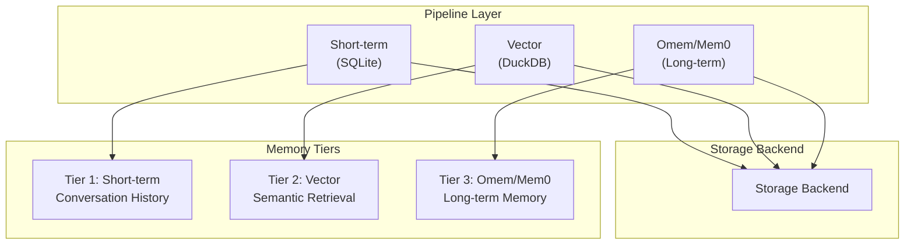
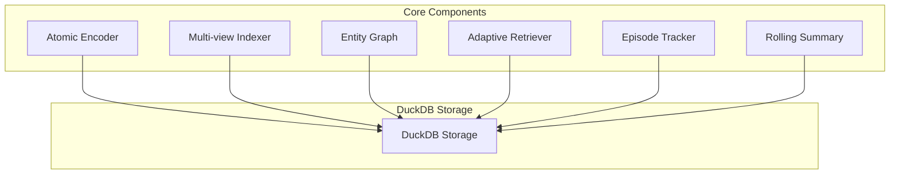

# Memory Engines

Memory engines in OpenEye handle persistent storage of conversation history and semantic context. OpenEye implements a multi-tier memory architecture that you can extend with custom engines.

## Overview

OpenEye's memory system consists of multiple tiers:

1. **Short-term Memory** (`memory.Store`): SQLite-based conversation history
2. **Vector Memory** (`memory.Engine`): DuckDB-backed semantic retrieval
3. **Omem** (`omem.Engine`): Advanced long-term memory with atomic facts
4. **Mem0** (`mem0.Engine`): Fact-based memory with graph relationships

This guide covers how to extend these memory systems.

## Memory Architecture



## Short-term Memory (SQLite)
## Short-term Memory (SQLite)

The basic memory store uses SQLite for conversation history:

### Store Interface

```go
package memory

// Store wraps a SQLite database for conversation history
type Store interface {
    // Append adds a new conversation turn
    Append(role, content string) error
    
    // Recent retrieves the most recent entries
    Recent(limit int) ([]Entry, error)
    
    // Close releases resources
    Close() error
}

// Entry represents a single conversational turn
type Entry struct {
    Role      string
    Content   string
    CreatedAt time.Time
}
```

### Custom Store Implementation

```go
package custommemory

import (
    "context"
    "database/sql"
    "fmt"
    "time"

    _ "github.com/mattn/go-sqlite3"
    "OpenEye/internal/context/memory"
)

type Store struct {
    db         *sql.DB
    insertStmt *sql.Stmt
    selectStmt *sql.Stmt
}

func NewStore(path string) (*Store, error) {
    db, err := sql.Open("sqlite3", fmt.Sprintf("file:%s?_busy_timeout=5000", path))
    if err != nil {
        return nil, fmt.Errorf("failed to open database: %w", err)
    }
    
    if err := bootstrap(db); err != nil {
        db.Close()
        return nil, err
    }
    
    insertStmt, err := db.Prepare(`INSERT INTO interactions (role, content, created_at) VALUES (?, ?, ?)`)
    if err != nil {
        db.Close()
        return nil, fmt.Errorf("failed to prepare insert: %w", err)
    }
    
    selectStmt, err := db.Prepare(`SELECT role, content, created_at FROM interactions ORDER BY created_at DESC LIMIT ?`)
    if err != nil {
        insertStmt.Close()
        db.Close()
        return nil, fmt.Errorf("failed to prepare select: %w", err)
    }
    
    return &Store{
        db:         db,
        insertStmt: insertStmt,
        selectStmt: selectStmt,
    }, nil
}

func bootstrap(db *sql.DB) error {
    _, err := db.Exec(`
        CREATE TABLE IF NOT EXISTS interactions (
            id INTEGER PRIMARY KEY AUTOINCREMENT,
            role TEXT NOT NULL,
            content TEXT NOT NULL,
            created_at INTEGER NOT NULL
        )
    `)
    if err != nil {
        return fmt.Errorf("failed to create table: %w", err)
    }
    return nil
}

func (s *Store) Append(role, content string) error {
    _, err := s.insertStmt.Exec(role, content, time.Now().UnixNano())
    if err != nil {
        return fmt.Errorf("failed to append: %w", err)
    }
    return nil
}

func (s *Store) Recent(limit int) ([]memory.Entry, error) {
    rows, err := s.selectStmt.Query(limit)
    if err != nil {
        return nil, fmt.Errorf("failed to query: %w", err)
    }
    defer rows.Close()
    
    var entries []memory.Entry
    for rows.Next() {
        var entry memory.Entry
        var timestamp int64
        if err := rows.Scan(&entry.Role, &entry.Content, &timestamp); err != nil {
            return nil, fmt.Errorf("failed to scan: %w", err)
        }
        entry.CreatedAt = time.UnixNano(timestamp)
        entries = append(entries, entry)
    }
    
    return entries, nil
}

func (s *Store) Close() error {
    s.insertStmt.Close()
    s.selectStmt.Close()
    return s.db.Close()
}
```

## Vector Memory (Semantic Retrieval)

Vector memory enables semantic search over conversation history:

### Engine Interface

```go
package memory

// MemoryEngine provides semantic memory capabilities
type MemoryEngine interface {
    // Store adds a new memory entry
    Store(ctx context.Context, text, role string) (int64, error)
    
    // Search finds similar memories
    Search(ctx context.Context, query string, limit int) ([]SearchResult, error)
    
    // BuildContext creates context from memories
    BuildContext(ctx context.Context, query string, maxTokens int) (string, error)
    
    // GetStats returns statistics
    GetStats(ctx context.Context) (map[string]interface{}, error)
    
    // Close releases resources
    Close() error
}

// SearchResult represents a memory search result
type SearchResult struct {
    ID        int64
    Text      string
    Role      string
    Score     float64
    CreatedAt time.Time
}
```

### Custom Engine Implementation

```go
package custommemory

import (
    "context"
    "fmt"
    "strings"
    "time"

    "OpenEye/internal/context/memory"
    "OpenEye/internal/embedding"
)

type Engine struct {
    provider embedding.Provider
    db      *CustomDB
}

func NewEngine(provider embedding.Provider, dbPath string) (*Engine, error) {
    db, err := NewCustomDB(dbPath)
    if err != nil {
        return nil, err
    }
    
    return &Engine{
        provider: provider,
        db:       db,
    }, nil
}

func (e *Engine) Store(ctx context.Context, text, role string) (int64, error) {
    vector, err := e.provider.Embed(ctx, text)
    if err != nil {
        return 0, fmt.Errorf("failed to embed: %w", err)
    }
    
    return e.db.Insert(text, role, vector)
}

func (e *Engine) Search(ctx context.Context, query string, limit int) ([]memory.SearchResult, error) {
    queryVector, err := e.provider.Embed(ctx, query)
    if err != nil {
        return nil, fmt.Errorf("failed to embed query: %w", err)
    }
    
    return e.db.Search(queryVector, limit)
}

func (e *Engine) BuildContext(ctx context.Context, query string, maxTokens int) (string, error) {
    results, err := e.Search(ctx, query, 10)
    if err != nil {
        return "", err
    }
    
    var contextBuilder strings.Builder
    tokenCount := 0
    
    for _, result := range results {
        text := fmt.Sprintf("[%s]: %s\n", result.Role, result.Text)
        estimatedTokens := len(text) / 4
        
        if tokenCount+estimatedTokens > maxTokens {
            break
        }
        
        contextBuilder.WriteString(text)
        tokenCount += estimatedTokens
    }
    
    return contextBuilder.String(), nil
}

func (e *Engine) GetStats(ctx context.Context) (map[string]interface{}, error) {
    count, err := e.db.Count()
    if err != nil {
        return nil, err
    }
    
    return map[string]interface{}{
        "total_entries": count,
        "engine":        "custom",
    }, nil
}

func (e *Engine) Close() error {
    return e.db.Close()
}
```

## Long-term Memory (Omem/Mem0)

Omem and Mem0 provide advanced memory capabilities:

### Omem Architecture



### Omem Adapter Integration
### Omem Adapter Integration

OpenEye's Omem uses a pipeline hook pattern:

```go
package omem

import "context"

type Adapter struct {
    engine    *Engine
    config   *Config
}

func NewAdapter(cfg Config, mgr *runtime.Manager, embedder embedding.Provider) (*Adapter, error) {
    engine, err := NewEngine(cfg, embedder)
    if err != nil {
        return nil, err
    }
    
    return &Adapter{
        engine:  engine,
        config:  &cfg,
    }, nil
}

func (a *Adapter) IsEnabled() bool {
    return a.config.Enabled != nil && *a.config.Enabled
}

func (a *Adapter) StoreTurn(ctx context.Context, userMsg, assistantMsg, turnID string) error {
    facts := a.engine.ExtractFacts(ctx, userMsg)
    facts = append(facts, a.engine.ExtractFacts(ctx, assistantMsg)...)
    return a.engine.StoreFacts(ctx, turnID, facts)
}

func (a *Adapter) Retrieve(ctx context.Context, query string, maxTokens int) (string, error) {
    return a.engine.BuildContext(ctx, query, maxTokens)
}

func (a *Adapter) GetStats(ctx context.Context) map[string]interface{} {
    return a.engine.GetStats(ctx)
}

func (a *Adapter) Close() error {
    return a.engine.Close()
}
```

### Pipeline Hook Pattern

```go
package omem

import "context"

type PipelineHook struct {
    adapter *Adapter
}

func NewPipelineHook(adapter *Adapter) *PipelineHook {
    return &PipelineHook{adapter: adapter}
}

// Called before generation to retrieve relevant memories
func (h *PipelineHook) OnBeforeGenerate(ctx context.Context, query string, maxTokens int) string {
    if h.adapter == nil || !h.adapter.IsEnabled() {
        return ""
    }
    context, _ := h.adapter.Retrieve(ctx, query, maxTokens)
    return context
}

// Called after generation to store new memories
func (h *PipelineHook) OnAfterGenerate(ctx context.Context, userMsg, assistantMsg, turnID string) {
    if h.adapter == nil || !h.adapter.IsEnabled() {
        return
    }
    go func() {
        if err := h.adapter.StoreTurn(ctx, userMsg, assistantMsg, turnID); err != nil {
            log.Printf("[omem] Failed to store turn: %v", err)
        }
    }()
}
```

## Configuration Integration

### Memory Configuration Structure

```go
type MemoryConfig struct {
    Path               string       `yaml:"path"`
    TurnsToUse         int          `yaml:"turns_to_use"`
    
    // Vector memory
    VectorEnabled      bool         `yaml:"vector_enabled"`
    VectorDBPath       string       `yaml:"vector_db_path"`
    EmbeddingDim       int          `yaml:"embedding_dim"`
    
    // Omem
    Omem               OmemConfig   `yaml:"omem"`
}
```

### YAML Configuration

```yaml
memory:
  path: "./openeye_memory.db"
  turns_to_use: 10
  
  vector:
    enabled: true
    db_path: "./openeye_vector.duckdb"
    embedding_dim: 768
  
  omem:
    enabled: true
    storage:
      db_path: "./openeye_omem.duckdb"
      max_facts: 10000
    atomic_encoder:
      enabled: true
      max_facts_per_turn: 10
    multi_view:
      enabled: true
      semantic_weight: 0.5
    entity_graph:
      enabled: true
      max_hops: 2
```

## Security Considerations

### 1. Input Validation

```go
func (s *Store) Append(role, content string) error {
    // Validate role
    if role != "user" && role != "assistant" {
        return fmt.Errorf("invalid role: %s", role)
    }
    
    // Validate content
    if len(content) > maxContentLength {
        return fmt.Errorf("content exceeds maximum length of %d", maxContentLength)
    }
    
    // Check for null bytes
    if strings.Contains(content, "\x00") {
        return errors.New("content contains null bytes")
    }
    
    return s.doAppend(role, content)
}
```

### 2. Path Traversal Prevention

```go
func NewStore(path string) (*Store, error) {
    // Sanitize path
    absPath, err := filepath.Abs(path)
    if err != nil {
        return nil, fmt.Errorf("invalid path: %w", err)
    }
    
    // Ensure path is within allowed directory
    allowedDir := "/safe/data/dir"
    if !strings.HasPrefix(absPath, allowedDir) {
        return nil, fmt.Errorf("path outside allowed directory")
    }
    
    // ... continue
}
```

### 3. SQL Injection Prevention

```go
// GOOD: Use parameterized queries
func (s *Store) Recent(limit int) ([]Entry, error) {
    // Parameterized query prevents SQL injection
    rows, err := s.selectStmt.Query(limit)
    // ...
}

// BAD: Never use string concatenation
func (s *Store) BadExample(query string) {
    // NEVER DO THIS
    sql := fmt.Sprintf("SELECT * FROM interactions WHERE role = '%s'", query)
}
```

## Performance Guidelines

### 1. Connection Pooling

```go
type Store struct {
    db *sql.DB
}

func NewStore(path string) (*Store, error) {
    db, err := sql.Open("sqlite3", path)
    if err != nil {
        return nil, err
    }
    
    // Configure connection pool
    db.SetMaxOpenConns(25)
    db.SetMaxIdleConns(5)
    db.SetConnMaxLifetime(5 * time.Minute)
    
    return &Store{db: db}, nil
}
```

### 2. Batch Operations

```go
func (s *Store) BatchAppend(entries []Entry) error {
    tx, err := s.db.Begin()
    if err != nil {
        return fmt.Errorf("failed to begin transaction: %w", err)
    }
    defer tx.Rollback()
    
    stmt, err := tx.Prepare("INSERT INTO interactions (role, content, created_at) VALUES (?, ?, ?)")
    if err != nil {
        return err
    }
    defer stmt.Close()
    
    for _, entry := range entries {
        if _, err := stmt.Exec(entry.Role, entry.Content, entry.CreatedAt.UnixNano()); err != nil {
            return err
        }
    }
    
    return tx.Commit()
}
```

### 3. Indexing

```go
func bootstrap(db *sql.DB) error {
    _, err := db.Exec(`
        CREATE TABLE IF NOT EXISTS interactions (
            id INTEGER PRIMARY KEY AUTOINCREMENT,
            role TEXT NOT NULL,
            content TEXT NOT NULL,
            created_at INTEGER NOT NULL
        )
    `)
    if err != nil {
        return err
    }
    
    // Create indexes for performance
    _, err = db.Exec(`
        CREATE INDEX IF NOT EXISTS idx_interactions_created_at 
        ON interactions(created_at DESC)
    `)
    
    _, err = db.Exec(`
        CREATE INDEX IF NOT EXISTS idx_interactions_role 
        ON interactions(role)
    `)
    
    return err
}
```

## Using Custom Memory

### Integration with Pipeline

```go
func NewPipeline(cfg config.Config, registry runtime.Registry) (*Pipeline, error) {
    // Use custom memory store
    store, err := custommemory.NewStore(cfg.Memory.Path)
    if err != nil {
        return nil, err
    }
    
    // Use custom vector engine
    vectorEngine, err := custommemory.NewEngine(embedder, cfg.Memory.VectorDBPath)
    if err != nil {
        store.Close()
        return nil, err
    }
    
    return &Pipeline{
        store:        store,
        vectorEngine: vectorEngine,
    }, nil
}
```

## Testing Memory Engines

### Unit Testing

```go
func TestStore_Append(t *testing.T) {
    store, err := NewStore(":memory:")
    if err != nil {
        t.Fatalf("Failed to create store: %v", err)
    }
    defer store.Close()
    
    if err := store.Append("user", "Hello"); err != nil {
        t.Fatalf("Append failed: %v", err)
    }
    
    entries, err := store.Recent(10)
    if err != nil {
        t.Fatalf("Recent failed: %v", err)
    }
    
    if len(entries) != 1 {
        t.Errorf("Expected 1 entry, got %d", len(entries))
    }
    
    if entries[0].Role != "user" {
        t.Errorf("Expected role 'user', got '%s'", entries[0].Role)
    }
}
```

### Integration Testing

```go
func TestEngine_Search(t *testing.T) {
    provider := embedding.NewLlamaCppProvider()
    engine, err := NewEngine(provider, ":memory:")
    if err != nil {
        t.Fatalf("Failed to create engine: %v", err)
    }
    defer engine.Close()
    
    ctx := context.Background()
    
    // Store some memories
    await engine.Store(ctx, "User likes Python", "user")
    await engine.Store(ctx, "User prefers dark mode", "assistant")
    
    // Search
    results, err := engine.Search(ctx, "What programming language?", 5)
    if err != nil {
        t.Fatalf("Search failed: %v", err)
    }
    
    if len(results) == 0 {
        t.Error("Expected search results")
    }
}
```

## Common Issues

### Database Locking

```go
// Use WAL mode for better concurrency
func bootstrap(db *sql.DB) error {
    _, err := db.Exec(`PRAGMA journal_mode=WAL`)
    if err != nil {
        return err
    }
    
    _, err = db.Exec(`PRAGMA synchronous=NORMAL`)
    return err
}
```

### Memory Growth

```go
func (s *Store) Prune(maxEntries int) error {
    count, err := s.db.QueryInt("SELECT COUNT(*) FROM interactions")
    if err != nil {
        return err
    }
    
    if count <= maxEntries {
        return nil
    }
    
    excess := count - maxEntries
    
    // Delete oldest entries
    _, err = s.db.Exec(`
        DELETE FROM interactions 
        WHERE id IN (
            SELECT id FROM interactions 
            ORDER BY created_at ASC 
            LIMIT ?
        )
    `, excess)
    
    return err
}
```

## Checklist for Production

- [ ] Input validation implemented
- [ ] SQL injection prevention (parameterized queries)
- [ ] Path traversal prevention
- [ ] Connection pooling configured
- [ ] WAL mode enabled for SQLite
- [ ] Indexes created
- [ ] Error handling complete
- [ ] Close() cleans up resources
- [ ] Unit tests passing
- [ ] Integration tests passing
- [ ] Performance benchmarks run

## Related Documentation

- [Quick Start Guide](index.md)
- [Architecture Guide](architecture.md)
- [Runtime Adapters](runtime-adapters.md)
- [Embedding Providers](embedding-providers.md)
- [Best Practices](best-practices.md)
